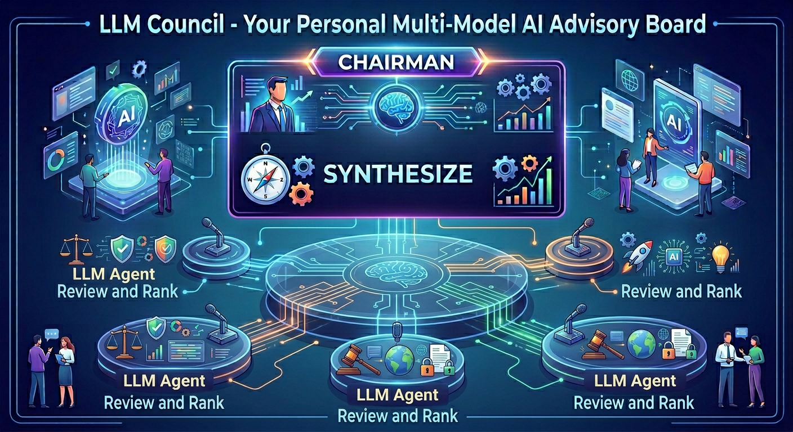

# LLM Council - Java Implementation

A Java implementation evolving the Language Model Council idea presented in the [arXiv paper](https://arxiv.org/pdf/2406.08598) and popularized by [Karpathy's LLM Council](https://github.com/karpathy/llm-council) using Spring Boot 4.x, Spring AI 2.0.0, Java 25, and Vaadin Hilla for the UI.

Multiple LLMs deliberate together through a structured 5-stage process: each model answers independently, ranks peers anonymously, identifies agreements and disagreements, and a designated chairman synthesizes the final response.



## Architecture

```
┌──────────────────────────────────────────────────────────────────────────────┐
│                            Vaadin Hilla Frontend                            │
│  ┌──────────────────┐  ┌────────────────┐  ┌──────────────────────────────┐ │
│  │ IndividualReview │  │  PeerRanking   │  │        AnalysisPanel         │ │
│  │      Panel       │  │     Panel      │  │  (Agreement / Disagreement)  │ │
│  └────────┬─────────┘  └───────┬────────┘  └──────────────┬───────────────┘ │
│           │                    │                           │                 │
│  ┌────────┴────────────────────┴───────────────────────────┴───────────────┐ │
│  │          FinalSynthesisPanel + ConsensusMetricsPanel + Query Input      │ │
│  └────────────────────────────────────────────────────────────────────────┘ │
└───────────────────────────────────┬──────────────────────────────────────────┘
                                    │ Hilla @BrowserCallable
              ┌─────────────────────┴──────────────────────┐
              │              CouncilEndpoint                │
              └─────────────────────┬──────────────────────┘
                                    │
              ┌─────────────────────┴──────────────────────┐
              │              CouncilService                 │
              │    (reactive, parallel LLM orchestration)   │
              └─────────────────────┬──────────────────────┘
                                    │
              ┌─────────────────────┴──────────────────────┐
              │            ChatClientRegistry               │
              │       (model-id → ChatClient routing)       │
              └────────┬──────────────┬──────────────┬─────┘
                       │              │              │
         ┌─────────────┴──┐  ┌───────┴──────────┐  ┌┴──────────────────────┐
         │  Anthropic API │  │ Google GenAI API  │  │  Anthropic via        │
         │  (Claude Haiku │  │ (Gemini 3 Flash,  │  │  Vertex AI rawPredict │
         │   4.5, Opus,   │  │  3.1 Flash Lite,  │  │  (routes Claude       │
         │   Sonnet)      │  │  3.1 Pro)         │  │   through GCP ADC)    │
         └────────────────┘  └───────────────────┘  └───────────────────────┘
```

## 5-Stage Deliberation Flow

1. **Stage 1: Individual Responses** — All council members answer the query in parallel via live LLM API calls. Each response includes token counts and latency metrics.

2. **Stage 2: Peer Ranking** — Each model receives the other members' responses anonymized as "Response A, B, C..." and ranks them. Rankings are aggregated into a leaderboard with consensus metrics (Kendall's W).

3. **Stage 3: Agreement Analysis** — Points of consensus across all responses are identified and surfaced, grouped by topic with mention counts.

4. **Stage 4: Disagreement Analysis** — Points of divergence and conflicting positions are identified and surfaced, with per-topic severity scoring.

5. **Stage 5: Final Synthesis** — The designated chairman model reads all prior stage outputs and synthesizes a single authoritative final answer.

### Quick Consult mode

The REST API also exposes a 3-stage variant via `POST /api/council/quick-consult`: stages 1, 2, and 5 only — peer ranking happens, but the agreement and disagreement analysis stages are skipped. The response is the same `SavedSession` JSON, with the agreement/disagreement aggregate fields returned empty. Use this when you want a chairman synthesis informed by ranked peer responses but don't need the full deliberation breakdown.

## Tech Stack

- **Java 25** with preview features enabled
- **Spring Boot 4.x**
- **Spring AI 2.0.0** — LLM abstraction layer with multi-model support
- **Vaadin Hilla 25.1.0** — Full-stack React + Spring integration with type-safe RPC
- **Project Reactor** — Reactive streams (`Flux` / `Mono`) for parallel async LLM calls
- **Caffeine** — In-memory session caching (1000 sessions, 2-hour TTL)
- **Anthropic API** — Direct integration for Claude models
- **Google GenAI API** — Direct integration for Gemini models
- **Anthropic Java SDK (Vertex)** — Routes Claude models through Vertex AI `rawPredict` using GCP ADC
- **Google Cloud Storage** — Optional session persistence to GCS
- **GraalVM** — Native image build support

## Project Structure

```
src/main/java/dev/council/
├── LlmCouncilApplication.java              # Spring Boot entry point
├── client/
│   ├── ChatClientProvider.java             # Interface for named chat clients
│   ├── AbstractChatClient.java             # Template method base with memory + streaming
│   ├── ChatClientRegistry.java             # Registry: model-id → ChatClient routing
│   ├── Opus46ChatClient.java               # Claude Opus 4.6 client bean
│   ├── Sonnet46ChatClient.java             # Claude Sonnet 4.6 client bean
│   ├── Haiku45ChatClient.java              # Claude Haiku 4.5 client bean
│   ├── Gemini3FlashChatClient.java         # Gemini 3 Flash client bean
│   ├── Gemini31FlashLiteChatClient.java    # Gemini 3.1 Flash Lite client bean
│   ├── Gemini31ProChatClient.java          # Gemini 3.1 Pro client bean
│   └── VertexAiAnthropicRequestInterceptor.java  # Routes Claude through Vertex AI rawPredict
├── config/
│   ├── CouncilConfig.java                  # Spring bean wiring for council
│   ├── CouncilProperties.java             # @ConfigurationProperties for council.yaml
│   ├── ObservabilityConfig.java           # Trace exporter (Cloud Trace or console)
│   ├── WebSocketConfig.java               # WebSocket buffer tuning
│   ├── ClientWarmupConfig.java            # ChatClient warm-up on startup (synchronous)
│   ├── MdcTraceLoggingEnhancer.java       # Bridge MDC to Cloud Logging trace fields
│   └── NativeRuntimeHints.java            # GraalVM reflection hints
├── model/
│   ├── CouncilMember.java                  # LLM model representation
│   ├── CouncilSession.java                 # Full session state + CouncilStage enum
│   ├── IndividualResponse.java             # Stage 1: member responses
│   ├── IndividualRanking.java              # Stage 2: per-member peer rankings
│   ├── IndividualAgreement.java            # Stage 3: per-member agreement points
│   ├── IndividualDisagreement.java         # Stage 4: per-member disagreement points
│   ├── FinalResponse.java                  # Stage 5: chairman synthesis result
│   ├── AggregateRanking.java               # Combined ranking scores
│   ├── AggregateAgreement.java             # Aggregated agreement points
│   ├── AggregateDisagreement.java          # Aggregated disagreement points
│   ├── ConsensusMetrics.java               # Kendall's W + disagreement severity
│   ├── SavedSession.java                   # Persistence wrapper with title
│   ├── TraceSummary.java                   # Cloud Trace view model
│   ├── TraceSpanDetail.java                # Trace span tree node
│   ├── TraceDuration.java                  # Trace query time range
│   └── schema/                             # JSON schema for structured LLM output
│       ├── RankingOutput.java
│       ├── AgreementOutput.java
│       └── DisagreementOutput.java
├── service/
│   ├── CouncilService.java                 # Orchestrates all 5 stages reactively
│   ├── ResponseParserService.java          # LLM output parsing with format fallbacks
│   ├── TraceRetrievalService.java          # Cloud Trace API integration
│   └── storage/
│       └── ConversationStorage.java        # Local file + GCS session persistence
├── endpoint/
│   ├── CouncilEndpoint.java                # Hilla @BrowserCallable API
│   └── CouncilApiController.java           # REST API for programmatic access
```

```
src/main/frontend/
├── App.tsx                                 # React router setup
├── index.ts                                # Entry point
├── views/
│   ├── MainLayout.tsx                      # App shell with navigation drawer
│   ├── CouncilView.tsx                     # Main council interface, stage orchestration
│   └── TracingView.tsx                     # Cloud Trace viewer
├── components/
│   ├── IndividualReviewPanel.tsx           # Stage 1: per-member response tabs
│   ├── PeerRankingPanel.tsx                # Stage 2: rankings grid + aggregate leaderboard
│   ├── AnalysisPanel.tsx                   # Stage 3 & 4: agreement / disagreement display
│   ├── FinalSynthesisPanel.tsx             # Stage 5: chairman synthesis + query input
│   ├── ConsensusMetricsPanel.tsx           # Kendall's W + severity visualization
│   ├── StageHeader.tsx                     # Shared stage header component
│   └── TraceCard.tsx                       # Trace viewer cards
├── utils/
│   └── council-utils.ts                    # subscribeToFlux() helper, color utils
└── themes/llm-council/
    └── styles.css                          # Custom theme
```

```
src/main/resources/
├── application.properties                  # Spring config + environment variable bindings
├── application-local.properties            # Local dev overrides (disable GCP export)
├── application-native.properties           # GraalVM native image config
├── council.yaml                            # Council member and chairman configuration
├── logback-spring.xml                      # Logging config (Cloud Logging JSON / plain text)
└── system/                                 # StringTemplate prompt files
    ├── individual-review.st                # Stage 1 prompt
    ├── peer-ranking.st                     # Stage 2 prompt (strict format)
    ├── agreement-analysis.st               # Stage 3 prompt
    ├── disagreement-analysis.st            # Stage 4 prompt
    ├── final-response.st                   # Stage 5 prompt
    └── title-generation.st                 # Session title generation
```

```
src/test/java/dev/council/
├── ApplicationContextTest.java             # Verifies Spring context bootstraps
├── support/
│   └── TestFixtures.java                   # Shared in-memory fixtures
├── client/
│   └── AbstractChatClientTest.java         # Memoization, concurrency, recovery
├── endpoint/
│   ├── CouncilApiControllerTest.java       # REST surface (pure Mockito)
│   └── CouncilEndpointTest.java            # Hilla @BrowserCallable surface
├── model/
│   └── IndividualResponseTest.java
└── service/
    ├── CouncilServiceTest.java
    ├── CouncilServiceFanoutTest.java       # Reactive fan-out across all 5 stages
    ├── ResponseParserServiceTest.java      # LLM output parsing fallbacks
    └── storage/
        └── ConversationStorageTest.java    # Local + GCS round-trips
```

### Customizing prompts

The five stage prompts and the title-generation prompt live as plain text in `src/main/resources/system/*.st`. They are [StringTemplate](https://www.stringtemplate.org/) files rendered per-stage by `CouncilService` with the council member set, the user query, and prior-stage outputs as template variables. Edit these files directly to tune behavior — no Java changes required.

## Configuration

### Council Members (`council.yaml`)

Council membership, chairman selection, and available models are driven entirely by `council.yaml` — no Java changes required to add or swap models:

```yaml
council:
  models:                                   # Active council members
    gemini-3-flash-preview:
      id: "gemini-3-flash-preview"
      name: "Gemini 3 Flash"
      provider: "Google"
      modelId: "gemini-3-flash-preview"
      avatarColor: "#1da1f2"
    gemini-3-1-flash-lite-preview:
      id: "gemini-3.1-flash-lite-preview"
      name: "Gemini 3.1 Flash Lite"
      provider: "Google"
      modelId: "gemini-3.1-flash-lite-preview"
      avatarColor: "#4285f4"
    claude-haiku-4-5:
      id: "claude-haiku-4-5"
      name: "Claude Haiku 4.5"
      provider: "Anthropic"
      modelId: "claude-haiku-4-5"
      avatarColor: "#d97706"

  available:                                # Models ready to activate
    models:
      claude-opus-4-6:
        id: "claude-opus-4-6"
        name: "Claude Opus 4.6"
        provider: "Anthropic"
        modelId: "claude-opus-4-6"
        avatarColor: "#10a37f"
      gemini-3-1-pro-preview:
        id: "gemini-3.1-pro-preview"
        name: "Gemini 3.1 Pro"
        provider: "Google"
        modelId: "gemini-3.1-pro-preview"
        avatarColor: "#1da1f2"
      claude-sonnet-4-6:
        id: "claude-sonnet-4-6"
        name: "Claude Sonnet 4.6"
        provider: "Anthropic"
        modelId: "claude-sonnet-4-6"
        avatarColor: "#d97706"

  chairman:
    model: "gemini-3-1-flash-lite-preview"

  title:
    model: "gemini-3-1-flash-lite-preview"

  summarize:
    model: "gemini-3-1-flash-lite-preview"
```

Move entries between `council.models` and `council.available.models` to activate or deactivate them. The `chairman.model` must match one of the model IDs defined in `council.models`.

#### Special model roles

Three model IDs in `council.yaml` drive non-deliberation work and can each point to a different model — typically a cheap/fast one to keep auxiliary calls inexpensive:

| Role | YAML key | Used for |
|------|----------|----------|
| Chairman | `council.chairman.model` | Stage 5 final synthesis |
| Title | `council.title.model` | Auto-generates a session title from the query |
| Summarize | `council.summarize.model` | Internal summarization for long contexts |

Each must reference a model ID present in `council.models` (active) or `council.available.models`. They can all point to the same model.

## Tested Models

Some of the models this app has been tested with:

| Model | Provider | Config key | Status |
|-------|----------|------------|--------|
| Claude Haiku 4.5 | Anthropic | `claude-haiku-4-5` | Active |
| Claude Opus 4.6 | Anthropic | `claude-opus-4-6` | Available |
| Claude Sonnet 4.6 | Anthropic | `claude-sonnet-4-6` | Available |
| Gemini 3 Flash | Google | `gemini-3-flash-preview` | Active |
| Gemini 3.1 Flash Lite | Google | `gemini-3.1-flash-lite-preview` | Active |
| Gemini 3.1 Pro | Google | `gemini-3.1-pro-preview` | Available |
| Gemini 2.5 Pro | Google | `gemini-2.5-pro` | Commented out |
| Gemini 2.5 Flash | Google | `gemini-2.5-flash` | Commented out |

To enable an available model, move its entry from `council.available.models` to `council.models` in `council.yaml`. The corresponding `ChatClient` bean must also be wired in `ChatClientRegistry`.

You can configure any model, as long as it is supported in Spring AI.

## Environment Variables / API Keys

### Anthropic (Direct API)

```bash
export ANTHROPIC_API_KEY=sk-ant-...
```

Only needed when `vertex.ai.anthropic.enabled=false`. When Vertex AI routing is enabled (the default), Claude models use Google ADC instead.

### Google Cloud

```bash
export GOOGLE_CLOUD_PROJECT=my-gcp-project-id
export GOOGLE_CLOUD_LOCATION=us-central1
```

Google authentication uses Application Default Credentials. Run `gcloud auth application-default login` before starting the application if credentials are not already configured.

### Vertex AI Anthropic Routing (Default)

By default, Claude models are routed through Vertex AI `rawPredict`, using Google ADC instead of an Anthropic API key:

```bash
# Enabled by default — set to false to use ANTHROPIC_API_KEY directly
export VERTEX_AI_ANTHROPIC_ENABLED=true
export VERTEX_AI_ANTHROPIC_LOCATION=global
```

### Application Properties

`application.properties` binds these environment variables to the Spring AI model configurations:

```properties
spring.ai.anthropic.opus46.api-key=${ANTHROPIC_API_KEY:}
spring.ai.google.genai.flash3.project-id=${GOOGLE_CLOUD_PROJECT}
spring.ai.google.genai.flash3.location=${GOOGLE_CLOUD_LOCATION}
vertex.ai.anthropic.enabled=${VERTEX_AI_ANTHROPIC_ENABLED:true}
```

You only need credentials for the providers whose models are enabled in `council.yaml`.

### Storage

Session persistence destination and paths are configurable via env vars:

```bash
# local (default) writes JSON files to data/conversations/
# cloud writes to a GCS bucket
export CONVERSATIONS=local            # or 'cloud'
```

| Env var | Property | Default | Notes |
|---------|----------|---------|-------|
| `CONVERSATIONS` | `conversation.storage.location` | `local` | `local` or `cloud` |
| _(none — set the property directly)_ | `conversation.dir` | `data/conversations` | Used when `local` |
| _(none — set the property directly)_ | `bucket.name` | `llm-council-conversations` | Used when `cloud`; bucket must already exist with ADC write access |

## Running the Application

### Prerequisites

- Java 25
- Node.js 18+
- Maven 3.9+
- API keys / ADC for the providers used by active council members

### Local Development (recommended for dev)

Run with the `local` profile to get plain-text logs and console-printed traces — no GCP credentials needed for observability:

```bash
./mvnw spring-boot:run -Dspring-boot.run.profiles=local
```

| Signal | Destination |
|--------|-------------|
| **Traces** | Console (`otel.spans` logger) |
| **Metrics** | `/actuator/metrics` only (Stackdriver export disabled) |
| **Logs** | Plain text to stdout |

### Cloud / Default Profile

Run without a profile to export all three signals to Google Cloud:

```bash
./mvnw spring-boot:run
```

| Signal | Destination |
|--------|-------------|
| **Traces** | Google Cloud Trace (via `TraceExporter` + ADC) |
| **Metrics** | Google Cloud Monitoring (via `micrometer-registry-stackdriver`, every 60s) |
| **Logs** | GCP Cloud Logging JSON to stdout (auto-ingested on Cloud Run/GKE/GCE) |

Requires:

```bash
export GOOGLE_CLOUD_PROJECT=my-gcp-project-id
gcloud auth application-default login
```

Logs include `logging.googleapis.com/trace` and `logging.googleapis.com/spanId` fields for automatic log-trace correlation in Cloud Console.

### Production Build

```bash
./mvnw clean package -Pproduction
java -jar target/llm-council-1.0.0-SNAPSHOT.jar
```

To run with the local profile:

```bash
java -jar target/llm-council-1.0.0-SNAPSHOT.jar --spring.profiles.active=local
```

### Native Image (GraalVM) 

```bash
./mvnw clean package -Pnative,production -DskipTests

# local profile, no OTEL
./target/llm-council --spring.profiles.active=native,local

# GCP telemetry enabled
./target/llm-council --spring.profiles.active=native
```

### Cloud Run Deployment

Deploy from source to Cloud Run:

```bash
gcloud run deploy llm-council \
  --source . \
  --project my-gcp-project-id \
  --region us-central1 \
  --set-env-vars GOOGLE_CLOUD_PROJECT=my-gcp-project-id,GOOGLE_CLOUD_LOCATION=global \
  --set-build-env-vars GOOGLE_BUILD_ARGS="-Pproduction" \
  --set-secrets ANTHROPIC_API_KEY=ANTHROPIC_API_KEY:latest \
  --memory 2Gi --cpu 4 \
  --min-instances 0 --max-instances 1 \
  --allow-unauthenticated
```

A `.gcloudignore` file excludes `target/`, `node_modules/`, `native/`, `.git/`, and documentation from the Cloud Build upload.

#### Speeding up Cloud Build

Cloud Build from source has no dependency cache between builds. To avoid re-downloading all Maven dependencies on every deploy, pre-populate a local cache:

```bash
./scripts/cache-deps.sh
```

This creates a `.m2-cache/` directory with all production dependencies (~1-2 GB). The `mvnw` wrapper automatically uses it when present, so Cloud Build finds all JARs locally.

For faster compilation, use a two-step deploy with a higher-CPU Cloud Build machine:

```bash
# Step 1: Build with more CPUs
gcloud builds submit \
  --project my-gcp-project-id \
  --region us-central1 \
  --machine-type E2_HIGHCPU_8 \
  --pack image=us-central1-docker.pkg.dev/my-gcp-project-id/cloud-run-source-deploy/llm-council \
  --set-build-env-vars GOOGLE_BUILD_ARGS="-Pproduction"

# Step 2: Deploy the pre-built image
gcloud run deploy llm-council \
  --project my-gcp-project-id \
  --region us-central1 \
  --image us-central1-docker.pkg.dev/my-gcp-project-id/cloud-run-source-deploy/llm-council \
  --set-env-vars GOOGLE_CLOUD_PROJECT=my-gcp-project-id,GOOGLE_CLOUD_LOCATION=global \
  --set-secrets ANTHROPIC_API_KEY=ANTHROPIC_API_KEY:latest \
  --memory 2Gi --cpu 4 \
  --min-instances 0 --max-instances 1 \
  --allow-unauthenticated
```

### Claude Code integration

If you use [Claude Code](https://claude.com/claude-code), this repo registers a `/consult-council` slash command (defined in `.claude/commands/consult-council.md`). Run it from any Claude Code session pointed at this directory and it will POST your question to a locally running council instance via `/api/council/consult`. Requires the app to be running on `localhost:8080`.

## REST API

In addition to the Hilla streaming UI, the council exposes a blocking REST surface in `CouncilApiController` for programmatic access:

| Method | Path | Stages run | Returns |
|--------|------|------------|---------|
| `POST` | `/api/council/consult` | 1, 2, 3, 4, 5 (full deliberation) | `SavedSession` JSON |
| `POST` | `/api/council/quick-consult` | 1, 2, 5 (skips agreement & disagreement) | `SavedSession` JSON (agreement / disagreement fields empty) |

Both endpoints accept the same payload:

```json
{ "query": "your question here" }
```

Example — full deliberation:

```bash
curl -sf -X POST http://localhost:8080/api/council/consult \
  -H "Content-Type: application/json" \
  -d '{"query": "Should we adopt event sourcing for the order service?"}' \
  --max-time 300
```

Example — quick consult (faster, no agreement/disagreement breakdown):

```bash
curl -sf -X POST http://localhost:8080/api/council/quick-consult \
  -H "Content-Type: application/json" \
  -d '{"query": "What are tradeoffs of CQRS for a small team?"}' \
  --max-time 180
```

These endpoints **block** the HTTP request thread for the full deliberation, bounded by `council.api.timeout` (default 5 min). For interactive use prefer the Hilla UI, which streams stage results back over WebSocket.

## Testing

```bash
./mvnw test
```

The unit-test suite uses pure Mockito and `reactor-test`'s `StepVerifier`; no Spring context, no live LLM calls. The major test classes:

- `ApplicationContextTest` — Spring context bootstraps cleanly with all wired beans
- `AbstractChatClientTest` — chat-client memoization, concurrent first-call dedup, recovery after a failed init
- `CouncilServiceFanoutTest` — reactive fan-out across all five stages, including session-not-found and error branches
- `CouncilServiceTest` — service-level orchestration paths
- `CouncilApiControllerTest` — REST surface (`/consult`, `/quick-consult`) end-to-end with mocked service
- `CouncilEndpointTest` — Hilla `@BrowserCallable` surface (session create, save, error mapping)
- `ResponseParserServiceTest` — LLM output parsing with format fallbacks
- `ConversationStorageTest` — local file and GCS persistence round-trips
- `IndividualResponseTest` — model-level invariants (e.g. blank/null content treated as error)

Shared helpers live under `src/test/java/dev/council/support/` (`TestFixtures`).

## Tuning / Operator Configuration

The application has several tunable properties beyond model selection. Most have safe defaults; override them via `application.properties`, env-specific profile properties, or `-D` flags.

| Property | Default | Why change it |
|----------|---------|---------------|
| `council.api.timeout` | `PT5M` | Blocking ceiling for the full REST deliberation |
| `council.endpoint.session-timeout` | `PT15S` | Hilla `createSession()` block — increase if title generation is slow |
| `council.endpoint.save-timeout` | `PT1M` | Hilla `saveCompletedSession()` block — increase for slow GCS writes |
| `server.tomcat.threads.max` | `30` | Headroom for concurrent blocking endpoint calls |
| `server.tomcat.threads.min-spare` | `10` | Idle thread-pool floor |
| `vaadin.atmosphere.maxWebSocketMessageSize` | `1048576` (1 MB) | Stage 2 peer-ranking responses can be large |
| `server.tomcat.max-http-form-post-size` | `10MB` | Bound on form-post bodies; LLM completions can be large |
| `logging.level.dev.council` | `INFO` | `DEBUG` adds per-Flux-element trace and prompt template rendering |
| `logging.level.org.springframework.ai` | `INFO` | `DEBUG` plus `spring.ai.chat.observations.log-prompt=true` and `log-completion=true` logs full prompt and completion text. **Leave off in production** to avoid logging sensitive content. |

**Client warmup.** `ClientWarmupConfig` triggers each `ChatClient` bean at startup so the first user request doesn't pay cold-start initialization cost. Synchronous — blocks application readiness until done.

**Session cache.** Caffeine, **1000 entries / 2-hour TTL**, currently hard-coded in `CouncilService.java:243-245` (`maximumSize(1000)` / `expireAfterWrite(Duration.ofHours(2))`). Not yet exposed as a property — flagged as a future tuning knob.

## Observability

The application implements three-signal observability: traces, metrics, and logs. The `local` profile switches all signals to console output; the default profile exports to Google Cloud.

### Traces (OpenTelemetry)

Each deliberation creates a span hierarchy:

```
council.deliberation.wrapper                    (root span, per session)
  └── council.stage1.individual-review          (parent span)
        ├── gen_ai.client.operation             (per ChatModel call, one per member)
        ├── gen_ai.client.operation
        └── gen_ai.client.operation
  └── council.stage2.peer-ranking
        └── ...
```

Span attributes include `council.stage`, `council.session.id`, `gen_ai.request.model`, and token counts.

### Metrics (Micrometer)

Custom council metrics (timers):

```bash
curl -s localhost:8080/actuator/metrics | jq '.names[]' | grep -E 'council|gen_ai'

# Per-stage timers
curl -s localhost:8080/actuator/metrics/council.stage1.individual-review | jq
curl -s localhost:8080/actuator/metrics/council.stage2.peer-ranking | jq
curl -s localhost:8080/actuator/metrics/council.stage3.agreement-analysis | jq
curl -s localhost:8080/actuator/metrics/council.stage4.disagreement-analysis | jq
curl -s localhost:8080/actuator/metrics/council.stage5.final-synthesis | jq

# Spring AI auto-generated
curl -s localhost:8080/actuator/metrics/gen_ai.client.token.usage | jq
```

In the default profile, metrics are exported to Google Cloud Monitoring (Stackdriver) every 60 seconds.

### Logs

- **Local profile**: Plain text to stdout via Logback
- **Default profile**: JSON to Google Cloud Logging with `logging.googleapis.com/trace` and `logging.googleapis.com/spanId` fields for automatic log-trace correlation

### Trace Viewer

The built-in Trace Viewer (`TracingView.tsx`) is mounted at `/traces` (e.g. `http://localhost:8080/traces`). It queries Google Cloud Trace and displays deliberation traces in the UI, with span trees, token counts, and links to Cloud Console. Requires `GOOGLE_CLOUD_PROJECT` to be set and ADC configured for read access to the trace API.

## Session Persistence

Completed deliberation sessions can be saved and reloaded:

- **Local storage** (default): JSON files in `data/conversations/`
- **Cloud storage**: Google Cloud Storage bucket (`llm-council-conversations`)

Configure via `conversation.storage.location` (`local` or `cloud`) in `application.properties`, or set the `CONVERSATIONS` env var. See [Storage](#storage) under *Environment Variables / API Keys* for the full configuration surface.

## License
Apache 2.0 License

## Disclaimer
This is not an official Google product. 

